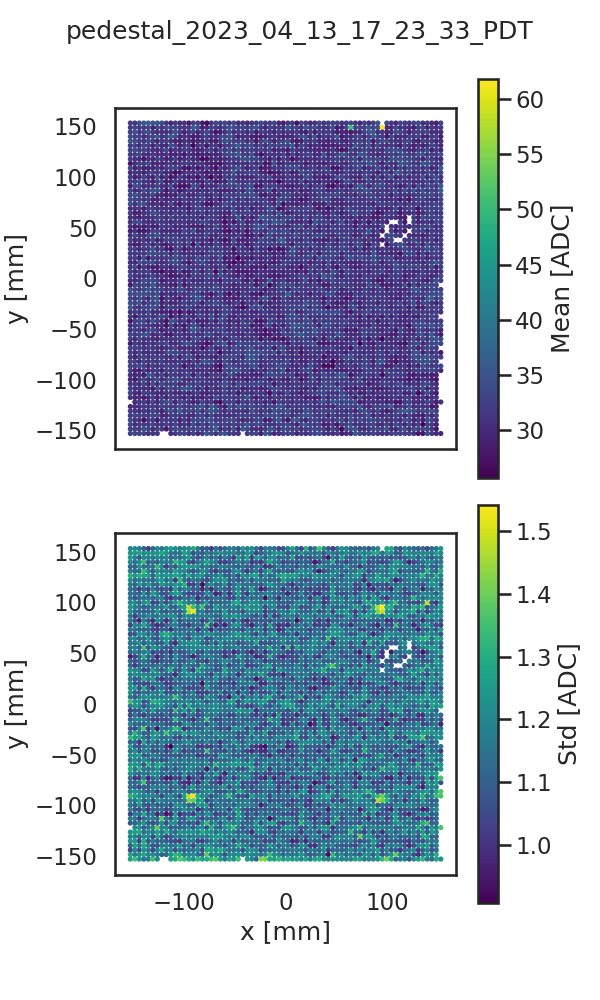
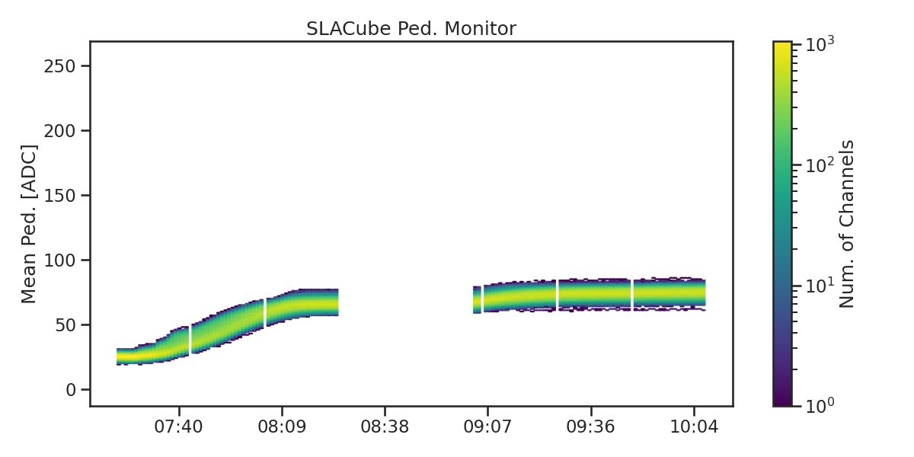
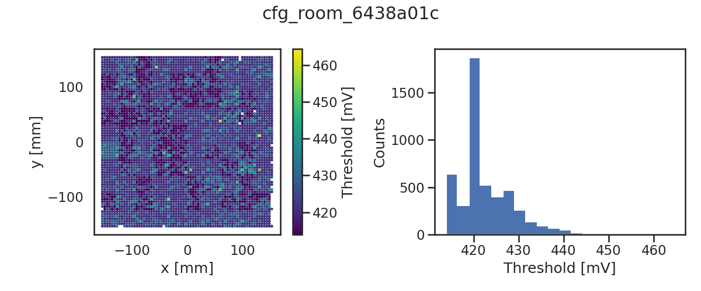
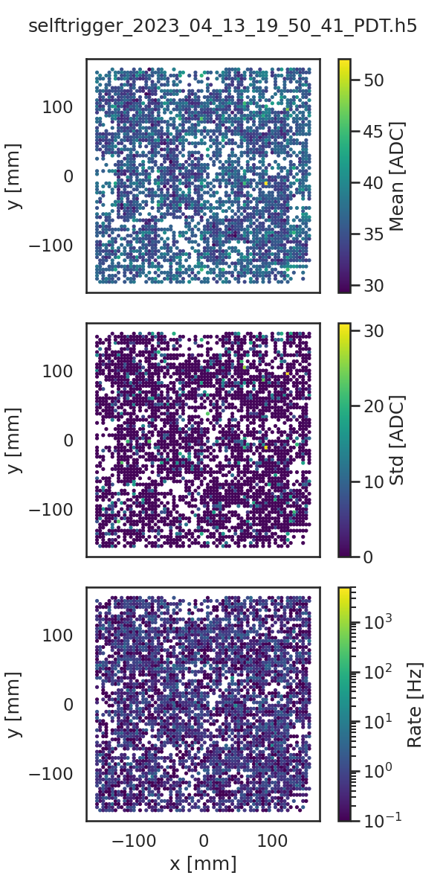

# SLACube DAQ Tutorial

## READ ME FIRST
- **DO NOT** power on LArPix during evacuation and HV ramping. Asked when in
  doubt.
- **DO NOT** run analysis jobs on DAQ machine. It should be done on dedicated
  computing clusters (e.g. `s3df`). Running diagnostic analysis is fine.
- Communicate on Slack
  - `slaclartpc.slack.com#lntf-ops` for operation related discussions and
    announcements.
  - `slaclartpc.slack.com#slarchetto-log` for logging activities and results
    (no discussion / replies).
- There is **NO** locking mechanism to prevent multiple users operating the
  DAQ. Please check if the system is free on `#lntf-ops` channel.
- **DO NOT** touch the system during the data-taking period (even a few days
  after), unless you are in charge. 
- You are welcome to try the tutorial as many times as you wish, given that not
  violating the above rules.
- Check this page frequently.

## Introduction

Remember two things:
1. `ssh slacube@slac.stanford.edu` (and password)
2. Execute `slacube`
It contains links and help pages to guide you through the SLACube DAQ system.

[](https://asciinema.org/a/rQgfTETyK7Qt48at15CxxpXwB)

Notes:
- It is recommended to use a terminal multiplexer (e.g. `screen` or `tmux`) on
  the remote machine, so that you (and other users) can attach/detach the
  ruining session.

## Working Environment

Although **slacube** script works in any folders, a custom working directory
(set to `$SLACUBE_WORKDIR`) is required to store run configurations, temporary
data files and diagnostic outputs.

To create an working environment:
```
   slacube env create some_name
```

The environment becomes active **ONLY** after sourcing the setup script:
```
   source $(slacube env curr)
```

[](https://asciinema.org/a/ijHmYXRtfgXRxcEMTkasOkyqx)

Notes:
- The same working environment is "reusable", given that the running
  condition remains unchanged.
- Remember the name of your working directory (make something unique to you).
- `slacube env curr` shows the setup script for last modified directory, which
  is the most likely environment for the next operation.
- `slacube env list` shows a list of available environments. Source any of them
  to activate.

See `slacube env help` for details.

## Interlude: Help Page
```
   slacube COMMAND help
```
_Some pages are missing as of 2023-04-15. Working in progress_

[](https://asciinema.org/a/II8USTcK29SM3V1P49EEsgWfe)

## Controller Configuration

A tile controller configuration defines the readout topology (i.e. Hydra
network) of the LArPix ASICs. Once the tile config is generated, it can be used
for the entire run unless there is a re-routing of the network to avoid
problematic chips.

To create a new hydra network:
```
   slacube hydra create
```
It will generates a json file, something like `tile-id_1-autoconfig.json`.

[](https://asciinema.org/a/Gbq1YnCVrMevoDbQFFTl7H7RT)

Keep an eye on the output. You should see **FOUR** good root chips:
```
... ...
good root chips:  [11, 41, 71, 101] 
... ...
```

Sometimes one of the root chip does not work, especially right after power
cycle. In such case, you may abort the job and try it again. The LArPix would
probably works without all 4 root chips, but missing one could indicates some
issues on the tile.

Set the tile config for later operations:
```
   slacube hydra set
```
Choose a config file and press `<Enter>` to confirm.

[](https://asciinema.org/a/ECk2ar9h585Qit2ZbjPNnahPr)

Plot the hydra network
```
   slacube hydra plot
```


Notes:
- Output figures are always saved to `$SLACUBE_WORKDIR`.
- X-forwarding over SSH maybe slow. Try `sshfs` or other `sftp` clients to view
  the image.
- Only four root chips 11,41,71,101 are connected externally for readout.
- The numbers in the upper corners of the root chips are `io_channel`, which
  gives the communication path for each chip. 
- Each chip belongs to one `io_channel` as indicated in different
  colors.
- If a chip is grayed out, it is not "reachable" from outside. It should not
  be happened in normal operation.
- A **chip key** is an unique identifier in form of `{io_group}-{io_channel}-{chip}`.
  - `io_group=1` for the SLACube setup.
  - `io_channel={1,2,3,4}`, as indicated in the figure.
  - `chip` ranges from 11 to 110 (a total of 10x10 ASICs per tile)
- For example, here are valid chip keys: 1-1-13, 1-2-55, 1-3-86, 1-4-101.
- Chip keys for the same ASIC may vary if a different controller config is used.

See `slacube hydra help` for details.

## Trigger Rate Test
 
Trigger rate test identified anomalous channels due to high leakage current. It
produces a bad channel list, where problematic channels are masked in further
operations.

To start a trigger rate test:
```
   slacube rate-test start
```
[](https://asciinema.org/a/pHJo4U0ulU3O34miL6paV9ruZ)

A few data files `trigger_rate_*.h5` and a json file started with
`trigger-rate-DO-NOT-ENABLE-channel-list-...` are produced.

To update the new bad channel list:
```
   slacube bad-channel set
```
[](https://asciinema.org/a/R6ZVUa9NWcDdhKPdASWlIPhCX)

Note:
- Use `slacube cfg` to check the current run configurations, including
  environmental variables and run-time files/directories.

See `slacube rate-test help`, `slacube bad-channel help` and `slacube cfg help`.

## Pedestal Test

Pedestal test identified channels with large pedestals. A new bad-channel is
generated after the test.

Start a quality control (QC) test:
```
   slacube pedestal start-qc
```

[](https://asciinema.org/a/kebwATHf625sEUNO19j8GHizQ)

A short pedestal run is taken `pedestal_...h5`.
A new bad channel list is generated `pedestal-bad-channels-...json`.
Another short pedestal run is taken with the updated bad channel list `recursive_pedestal_...json`.

Make pedestal plots:
```
   slacube pedestal plot
```
Select a pedestal file, and press `<Enter>`.



Notes:
- For further diagnostic, a csv file is generated from the plot command.
- Do not pay attention to the empty patterns on the pedestal figures. These are
  known features.
- The QC test only mask the bad channel with large pedestal > 125 ADC. It is
  possible to mask channels with high std, 
  `start-qc --apply_noise_cut --noise_cut_value MAX_STD`, 
  which is less often used.
- You can mask individual channel manually using the chip-key + channel (see
  [Bad Channel List](#bad-channel-list)).

Set the latest bad channel list:
```
   slacube bad-channel set
```
Pick the latest `pedestal-bad-channels-...json` and press "Enter".

Double check with a single pedestal run (without QC test):
```
   slacube pedestal start
```
It only take a single pedestal run and does not produce a new bad channel list.
Plot the latest pedestal file and check the figure.

At this point, most of the bad channels are masked automatically by rate and
pedestal QC tests. A few more channels might still need be added manually. As
for safety break point, it is recommended to duplicate the bad channel list at
this stage.

Copy the current bad channel list:
```
   slacube bad-channel copy
```
A new copy of the json file is set for later operation.

[](https://asciinema.org/a/BYY96PMBANmSidW25m4skDq4R)

See `slacube pedestal help`.

## Bad Channel List

Mask ALL channels of chip 1-3-88
```
   slacube bad-channel add 1-3-88
```

Mask channels 1,3,5 of chip 1-4-102
```
   slacube bad-channel add 1-4-102 1,3,5
```
Input the target channels as a comma separated list (no space).

[](https://asciinema.org/a/A2azay8kgJ50I1uNkWuzdKBfO)

Notes:
- The `add` command overwrites (edit in place) the current bad channel list. It
  is recommended to make a copy before editing. See [Pedestal](#pedestal-test).
- There is **NO** validity check on the chip-key. See [Controller
  Configuration](#controller-configuration) .
- There is **NO** unmask function. Simply revert the changes using `set`
  command to one of the previous versions.
- It is possible to edit the bad channel list json file manually.
- It is _unlikely_ to make extensive edit on the bad channel list.

See `slacube bad-channel help`

## Pedestal Monitor

For a long-term pedestal monitoring (e.g. during filling), a series of 10 mins
run are taken with low frequency periodic trigger. 

To start pedestal monitor runs:
```
   slacube ped-mon start
```
Data files are transferred to `$SLACUBE_DROPBOX`.

To stop pedestal monitor runs, execute the following command in a _different_
terminal / shell:
```
   slacube ped-mon stop
```
Data-taking will stop after the current run is over. If you are impatient, you
could abort the commend `<CTRL>-c` (not recommended as it leaves partial data
file in the working directory). 

You need to analyze each pedestal file one-by-one:
```
   slacube ped-mon analyze
```
Pick a file from `$SLACUBE_DROPBOX` interactively.

You can provide the file path for running non-interactively,
```
   slacube ped-mon analyze path-to-ped-file.h5
```

For the following example, let's analyze the pedestal during cooling on Jul 29, 2022.
Data files are stored under `/data/slacube/ped-mon-test` on `nu-daq01-ir2`.

```
   for f in /data/slacube/ped-mon-test/*.h5
   do
     slacube ped-mon analyze $f
   done

   slacube ped-mon plot
```


Notes:
- Be caution about using file globing `*.h5` on `$SLACUBE_DROPBOX`. The
  command **DOES NOT** check for incremental update. In practice only analyze
  the files you need.
- The outputs are stored in `$SLACUBE_DROPBOX/ped_mon`. The `plot` command will
  use it by default. Alternatively, you may specify a `ped_mon` directory.

## Threshold Setting

The `threshold` command determines the self-triggered threshold for each
channel. The goal is to keep the trigger rate as low as 2 Hz per channels.
The algorithm is based on a reference pedestal file.

After the preparation of the bad channel list, set a reference pedestal file:
```
   slacube pedestal set
```
Pick the latest and greatest pedestal run from the popup window.

Generate threshold config (at room temperate):
```
   slacube threshold start
```

Generate threshold config (at cryo temperate):
```
   slacube threshold start --cryo
```

[](https://asciinema.org/a/1oiJ1xe2QI66HVKhbb6NRIZuU)

Once the threshold setting process is finished, the script will automatically
set `CFG_DIR` to a newly generated folder. Remember this location as you may
need to fine-tune the thresholds manually.

If the following error shows up:
```
total packets 33475     1-1-19 21031
offending channel, triggers: [(10, 21031)]
                high rate channels! raise global threshold 40
Traceback (most recent call last):
  File "/home/slacube/app/scripts/larpix_qc/threshold_qc.py", line 715, in <module>
    c = main(**vars(args))
  File "/home/slacube/app/scripts/larpix_qc/threshold_qc.py", line 600, in main
    enable_frontend(c, channels, csa_disable)
  File "/home/slacube/app/scripts/larpix_qc/threshold_qc.py", line 257, in enable_frontend
    raise RuntimeError(diff,'\nconfig error on chips',list(diff.keys()))
RuntimeError: ({Key('1-1-19'): {73: (252, None)}}, '\nconfig error on chips', [Key('1-1-19')])
```
Look for the line about _offending channel_ and the line before. In this
example, chip-key:1-1-19 channel:10 is causing the trouble. Mask out the
problematic channel.
```
   slacube bad-channel add 1-1-19 10
```

Repeat `slacube threshold start [--cryo]` until no further error pops out.
Sometimes it takes a few iterations, however, having a large number of bad
channels may indicate fundamental problem with the setup.

Plot the thresholds:
```
  slacube threshold plot
```

[](https://asciinema.org/a/AWFHtM6E3MgnP6iR5Cn7OBm8r)



Notes:
- For diagnostic purpose, you can use `VDDA=1800` (just press "<Enter>"). For
  more precise voltage readout, see [Power Management](#power-management).
- For cryo (cold) operation, answer `y` for the `is_cryo?`.
- The thresholds are ~400+/-50 mV (at room temperature) and ~700+/-50 mV
  (cryo).

See `slacube threshold help`

## Self-Trigger Test

Self-trigger test ensures the bad channel list and threshold are set properly,
such that data rate is manageable when there is no signal (at room temperature or
zero E-field in cold). The test is performed after setting the threshold.

Start a short self-trigger test of 2 mins:
```
   slacube selftrig start --runtime 120
```

[](https://asciinema.org/a/6m5cbNaC6VlcNEhaXdOKunzyK)

Note:
- Keep an eye on the message rate. Ideally it should be around 1-10 kHz.
- If the rate is too high, plot the channel rate. Mask the problematic channel,
  if there is any.
- Sometimes it is useful to increase the global threshold by a few (<3) DACs.
  See [Threshold Adjustment](#threshold-adjustment).
- We did suffer from extremely high trigger rate due to grounding scheme. In
  such case, fine-tuning the thresholds did not help much.
- You can repeat self-trigger run with longer time. The default is 10 mins with
  `--runtime` option.

Convert the raw file
```
   slacube seftrig convert
```
Pick a raw file from the list.

Plot the self-trigger rate using the converted file:
```
  slacube selftrig plot
```



Notes:
- the channel data packet rate is O(1) Hz.
- it is ok for some empty spots (no trigger on those channel).

See `slacube selftrig help`

## Threshold Adjustment

There are two type of thresholds:
1. global threshold (coarser) each chip, ranges 0-255,
2. trim threshold (finer) for each channel, ranges 0-31.

To increase global threshold of ALL chips by 1 DAC,
```
   slacube threshold adjust global +1
```

To decrease global threshold of 1-4-103 by 1 DAC,
```
   slacube threshold adjust global -1 1-4-103
```

To increase trim threshold of 1-1-28 (all channels) by 3 DAC,
```
   slacube threshold adjust trim +3 1-1-28
```

To decrease trim threshold of 1-2-55 (channels 1,5,9) by 2 DAC,
```
   slacube threshold adjust trim -2  1-2-55 1,5,9
```

[](https://asciinema.org/a/fNAupQv2LoXp1nEkB4yitZhlH)

Notes:
- Like editing bad channel list, adjusting thresholds is also taken in-place.
  Please make a copy of the original configuration, `slacube threshold copy`.
- To revert the changes, use `slacube threshold set` to the original copy.
- Inactive channels are ignored (no adjustment).
- The new values are always in ranges. No adjustment beyond upper/lower limit.
- Channel list is comma separated without space.
- Adjustment of trim threshold is very unlikely.

See `slacube threshold help`

## Taking Data

Once the thresholds are set to a reasonable data rate, you can take data
continuously. The strategy is taking a short pedestal run followed by multiple
self-trigger runs.

To start data-taking:
```
   slacube run start
```

The default settings is a 2-min pedestal run and three 20-min selftrigger runs.
It loops forever until a stop signal. Raw data files are converted in a queue
and staged under `$SLACUBE_DROPBOX`.

To stop data-taking:
```
   slacube run stop
```

Same as `ped-mon` command, stop signal take effect only after the end of a run.
Aborting the jobs `<CTRL>-c` works if needed, but a clean stop is preferred.

There are some cases we want to take some data, even the data rate is huge. As
such, you may need to decrease the self-trigger runtime. In the worst case, you
will need to stop data-taking and finish the raw data conversion first. Also
you may need to free up disk space for new data (to be discussed).

Here is an example of taking a 2-min (120s) pedestal run, followed by five
5-min (300s) selftriger runs:
```
   slacube run 120 300 5
```

## Archive Run Config

For book-keeping, please archive the run config during/after data-taking. Usually the
same configuration are used for an extended period, e.g. one for the
entire runs at room temperature and one for cryo, unless there is a change in
bad channels, thresholds ... etc.

```
   slacube cfg archive
```

Notes:
- The config is committed (by git) to `${SLACUBE_GIR_DIR}/configs`.
- Only the current controller config, bad channel list and threshold config are
  kept.
- Temporary and backup copies of bad channel list and threshold are **NOT** archived.

[](https://asciinema.org/a/NwzpaPUEKOAtIH48tzhXRh9qw)

See `slacube cfg help`

## Power Management

Report the current and voltage readouts:
```
   slacube power status
```

Power down the LArPix tile:
```
   slacube power down
```
Answer the two prompt questions to proceed. Check the power status again, `slacube power status`.

Notes:
- After power down the LArPix, the readings are small ~10 mV or mA, but not zeros.
- The LArPix will power on again when it is in operation.

See `slacube power help`

## Tasks for the Tutorial

### Before doing anything
- [READ ME FIRST](#read-me-first)
- Notify `#lntf-ops`. Make sure
  - it is ok to power on the LArPix
  - you are the only user running the DAQ
- put an entry "Power on LArPix" on `#slarchetto-log` when you are about to
  execute the first command.

### Tasks for beginner
- create a new working environment
- create a new controller file
  - plot the hydra network
- perform trigger rate test
  - set the bad channel list generated by the rate test
- run a pedestal QC test
  - plot the mean and std pedestal before and after the QC test
  - take a single pedestal run
  - set the bad channels list generated by the pedestal QC test
- reproduce pedestal monitor plot using `/data/slacube/ped-mon-test` data
  samples
- make a threshold config at room temperature 
  - plot the self-trigger threshold
- take a self-trigger run
  - plot the channel rate 
- archive the current cfg

### Tasks for intermediate level user
- mask an entire chip 
  - take a single pedestal run
  - confirm the new mask with the mean and std pedestal figure
- adjust the global threshold of ALL chips by a small amount (within +/-5 DAC)
  - take a selftriger run
  - check the message rate 
  - confirm with the rate plot
- take pedestal monitor runs for ~1 hr
  - analyze the pedestal file as soon as it arrives to `$SLACUBE_DROPBOX`
  - make a "keep-up" plot of the pedestal monitor figure
  - stop ped-mon at ~1 hr  mark
- take some long runs, pedestal + self-trigger, for ~1 hr
  - stop data-taking at ~1 hr mark

### When you are done
- power down the LArPix
  - check power status
  - put an entry "Power down LArPix" on `#slarchetto-log`.
- check the folder `/home/slacube/queue`
  - if there are files other than `done` and `fail`, it means there are pending
    jobs for raw data conversion. You can come back and check later.
  - if there is something inside `fail` folder, let me
    (`slaclartpc.slack.com#PatrickTsang`) know.
  - it is ok clean up the `done` folder.
- cleanup `$SLACUBE_DROPBOX`
  - the data files taken in the tutorial are unlikely to be useful for others.
  - delete the files you generated (according the the timestamps)
- keep or remove `$SLACUBE_WORKDIR`
  - download the figures, tables ... whatever you want to keep.
  - as mentioned earlier, you can reuse your working environment.
  - if so, remember the working directory. You need to source the setup script
    in the next session.
  - `slacube env curr` may not give you the same working directory if somebody
    use after your session.
  - if you don't intend to reuse the same environment, please delete it.
